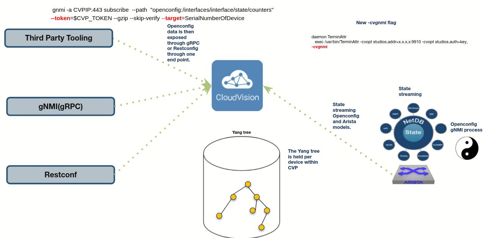

# CVP to Influx
#### A go based tool that will take openconfig telemetry from a single cvp instance and insert the data into InfluxDB
<p>

This is currently a beta feature and not considered to be production as of CVP 2021.3.0.  The next relase for CVP should be GA.

This is a tool built to leverage the streaming telemetry openconfig interface from cvp which uses the industry standard gnmi grpc service.  The idea is to be able to take streaming telemetry from cvp and insert it into InfluxDB.  The reason why this exists is that we need to merge the cvp inventory via the [resource apis](https://aristanetworks.github.io/cloudvision-apis/examples/rest/inventory/) extract their serial number and use that as the target for gNMI streaming.  Since this tool talks specifically to CVP we need to distinguish each switch.  Inside of the openconfig spec there is the idea of the [target field.](https://github.com/openconfig/reference/blob/master/rpc/gnmi/gnmi-specification.md#2221-path-target)

CVP is built in a way that we can use any gNMI client to then pass in a path [target](https://github.com/openconfig/reference/blob/master/rpc/gnmi/gnmi-specification.md#2221-path-target) which instructs cvp to then use the telemetry of the path target.  In the CVP situation the path target is the devices serial number.



The cvp-to-influx tool will first talk to the cvp api with a valid service token.  CVP will return its list of devices.  The tool will then stream the path which is listed within the config.yaml file with the target.


This data can then be graphed within grafana or within influx 2.0

## Prerequisites

### YAML overview
```shell
cvp_server: "x.x.x.x:443" #Address of cvp prior to 2021.3.0 this is 8443, above is 443
influxurl: "http://x.x.x.x:8086/" #URL of the influx api
influxorg: "InfluxData" #Organization that influx uses
influxbucket: "nameofbucket" #Bucket name inside of influx
cvptoken: "cvp token" #CVP service token
influxtoken: "secret influx token" #Secret token for influx
measurement: "interfaces" #Measurement can be any name you would like
path: "/interfaces/interface/state/counters" #Openconfig path
origin: openconfig #Openconfig origin only openconfig is currently supported.
streammode: on_change #Stream mode.
```

Every switch must be connected to cvp through terminattr and must leverage the new -cvgnmi flag for example,

```
daemon TerminAttr
   exec /usr/bin/TerminAttr -ingestgrpcurl=x.x.x.x:9910 -cvcompression=gzip -ingestauth=key, -smashexcludes=ale,flexCounter,hardware,kni,pulse,strata -cvgnmi -ingestexclude=/Sysdb/cell/1/agent,/Sysdb/cell/2/agent -taillogs
   no shutdown
```

Every switch need to have the gNMI interface running.

config
```
management api gnmi
   transport grpc default
```

verification
```
switch1#show management api gnmi
Transport: default
Enabled: yes
Server: running on port 6030, in default VRF
SSL profile: none
QoS DSCP: none
Authorization required: no
Accounting requests: no
Certificate username authentication: no
Notification timestamp: last change time
Listen addresses: ::
```

cvp: 2021.2.0 <br>
eos: 4.26.0F <br>
Influx: 1.8 and above.  This testing has been done on 2.0.<br>

## Debugging to find paths

We have created a site with many examples of using [gnmi](https://aristanetworks.github.io/openmgmt/examples/gnmi-clients/arista-gnmi/)
<br>
Here is an example of using cvp and gnmi via the gnmic client.
```
gnmic -a x.x.x.x:8443  subscribe  --path  "openconfig:/interfaces/interface/state/counters" --token=$tok --gzip --skip-verify --target=JPE123ABC
```
Where the target flag in this scenario is the serial of a device currently streaming in cvp and the token is the cvp service token.

## Demos

To run the macbook demo it can be found within the docs/demo.md

## Running the tool
for linux use the ./cvp-to-influx-linux <br>
for mac use the ./cvp-to-influx-darwin
```
cd bin
./cvp-to-influx-linux -config ../config.yaml
2022/01/13 10:35:40 Total Devices found from CVP
INFO    DMZ-LF9.sjc.aristanetworks.comSSJ172008662022-01-13 15:35:40.820576796 +0000 UTC/n
INFO    DMZ-LF4.sjc.aristanetworks.comJPE160126542022-01-13 15:35:40.820587857 +0000 UTC/n
INFO    Started streaming using target ID   SSJ172008662022-01-13 15:35:42.821740461 +0000 UTC2022/01/13 10:35:42
INFO    Started streaming using target ID   JPE160126542022-01-13 15:35:42.821888367 +0000 UTC2022/01/13 10:35:42
2022/01/13 10:35:43 Path /interfaces/interface[name=Ethernet2]/state/counters/in-unicast-pkts Target SSJ17200866 PathValue 556378
2022/01/13 10:35:43 Path /interfaces/interface[name=Ethernet1]/state/counters/in-octets Target JPE16012654 PathValue 2477344
2022/01/13 10:35:43 Path /interfaces/interface[name=Ethernet1]/state/counters/in-multicast-pkts Target JPE16012654 PathValue 8606
2022/01/13 10:35:43 Path /interfaces/interface[name=Ethernet2]/state/counters/out-unicast-pkts Target SSJ17200866 PathValue 484102
```

## Issues
- Only the openconfig origin is currently supported.
- No hot reload.  So if you add a new device you will have to reload the device.
